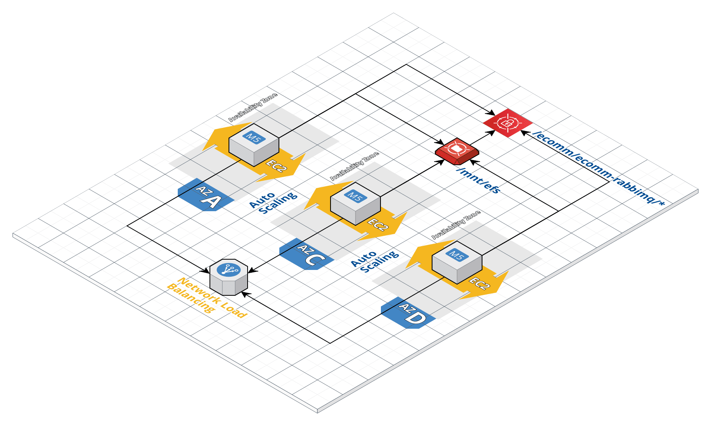
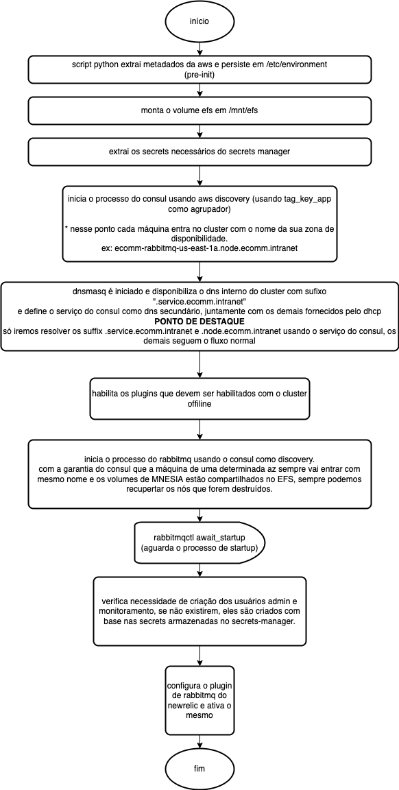

# Rabbitmq Cluster (Versão EC2 com Autoscaling)

## Arquitetura



Essa arquitetura tem um diferencial de ter 3 autoscaling pela seguinte razão:

* Tratamos cada zona de disponibilidade **como ponto de disponibilidade um único nó de rabbitmq**, onde se quisermos escalar mais rabbitmq's, teríamos que adicionar zonas de disponibilidades.

* Cada Autoscaling cuida de uma az, onde cada Autoscalign suporta somente no máximo um nó, usamos o autoscaling somente pela capacidade dele de **healing** dos nodes em caso de falha a nível de EC2 (podemos colocar a nível de NLB também mas por hora limitamos a EC2).

* Os serviços que estão rodando em cada instancia utilizam do [Quorum Consensus Protocol](https://www.consul.io/docs/architecture/consensus) e como estamos usando uma disponibilidade inicial de 3 nós, temos capacidade de perder simultaneamente 1 zona de disponibilidade.

* Os rabbitmq utilizam do [EFS](https://aws.amazon.com/pt/efs/) para persistir as informações de MNESIA (são as informações voláteis que contém dados de filas persistidas e configurações do management por exemplo.), assim, caso um nó precise ser completamente trocado, o novo nó assume sem necessidade de perda dessas informações.

* As filas estão todas configuradas para trabalhar com "Quorum" para dar maior disponibilidade e garantir maior resiliência do serviço.

## Imagem Base

A receita da ami da imagem base está disponível no [repo de infra-provisioning](https://github.com/belezanaweb/infra-provisioning/tree/master/packer/rabbit-cluster/).

Utilizamos packer para gerar a imagem e devemos destacar alguns pontos:

* Utilizamos Amazon Linux 2 para aproveitar bem as features de segurança e suporte do [SSM](https://docs.aws.amazon.com/pt_br/systems-manager/latest/userguide/ssm-agent.html)
* Usamos o repo <https://packagecloud.io/install/repositories/rabbitmq/> como base para instalar os pacotes necessários do rabbitmq
* TODO: melhorar o hardening

## Processo de Inicialização

O processo de inicialização segue o modelo descrito no fluxo diagramado abaixo:



Todo o código está disponível [aqui](./init.sh) onde o template é renderizado com as variáveis definidas no tempo de criação dos recursos e armazenado no template de instancia do AutoscalingGroup.

O processo de inicialização foi pensado totalmente no caso de resiliência, então ele trabalha nas seguintes hipóteses:

* Falha de node que precisar restaurar uma az com node problemático
* Rotacionamento de instancia para troca de ami ou atualização de plugins/componentes
* Processo travado que requisitar ação brusca de retirar um nó do cluster para que entre um saudável.

Se for necessário retirar configurações já feitas no cluster, uma ação mais brusca deve ser feita:

* entrar em um dos nodes pelo SSM e limpar o conteúdo do diretório `/mnt/efs`, e em seguida realizar rotação dos nodes.
* aplicar terraform destroy, destruindo toda a arquitetura, e em seguida recriando, assim o efs que tem os dados persistidos pode ir embora.

## Porque diabos o consul tá no meio disso tudo?

Resposta: Vozes da minha cabeça que me orientaram!


Brincadeiras a parte, eis a explicação plausível para o racional.

### Problema: problemas usando o discovery da AWS

Inicialmente partimos do discovery da AWS para resolver a instância, mas deparamos com um problema ao fazer testes de resiliência. Devido ao uso do ip privado como parte do dns fornecido pelo dhcp da rede privada da aws, as máquinas entravam sempre com nome como `rabbit@<ip-interno-1>` onde eles usam o ip interno como parte do nome da instancia na rede. Sendo assim:

* Se reiniciarmos uma instancia na zona `a` ao invés de recuperarmos o mnesia disponível no `efs` ele criava outra pasta vazia para outro host que era criado com o nome `rabbit@<ip-interno-2>`
* Além de não termos recuperação de forma automatizada do mnesia, o cluster ao invés de voltar a mostrar 3 nós saudáveis ele mostrava que entrava um nó novo `rabbit@<ip-interno-2>` e que o nó `rabbit@<ip-interno-1>` estava perdido.
* Tente imaginar como fica bonito essa visibilidade depois que fizermos uns 3 restarts com rotação dos nodes, teríamos na visão de nodes `9` registros, 3 registros `online` e 6 registros `down` dos nodes.
* A única garantia de HA que teríamos seria as filas configuradas em `quorum`, mas não teríamos HA das configurações de shovel por exemplo.

Diante desse cenário encontramos 3 soluções:

* Ação manual após o restart de mover o mnesia pra dentro da pasta correta e o init do rabbitmq não inicializar o serviço, parte do serviço teria que ser manual para mover por exemplo o mnesia para o local correto.
* Intervir no dhcp da AWS e buscar uma solução para que os dns's privados das intancias tivessem um controle "estático".
* Buscar uma outra forma de discovery que pudesse resolver esse problema de dns que respeitasse que um dns de uma az é sempre o mesmo e é definido na inicialização.

Consideramos a última a mais vantajosa, pois ela é menos invasiva em relação a mudança estrutural (só mudamos no escopo de dentro da solução), e como o processo do consul é bem simples (único binário sem dependencia com nenhuma biblioteca específica), não encontramos impedimentos para implantar.

O ponto de falha é que assim como o rabbitmq, ele é sujeito ao [Quorum Consensus Protocol](https://www.consul.io/docs/architecture/consensus), então não podemos perder simultaneamente mais de um nó do cluster, e considerando que já não poderíamos dar esse luxo antes, não tivemos uma "perda" com essa escolha.

Seria melhor se o consul estivesse externo, mas teria mais custo e seria mais complicado de manter, e considerando que ele será usando somente nesse solução por hora, iremos manter dessa forma.

### Referências sobre consul

* [Este artigo sobre service discovery](https://medium.com/trainingcenter/entendendo-orquestradores-parte-1-service-discovery-4219d604335c)
* [Learn Hashicorp Consul](https://learn.hashicorp.com/tutorials/consul/get-started-service-discovery)

O único diferencial do que foi feito aqui em relação à literatura, foi além das mudanças sugeridas nos passos de [dnsmasq](https://learn.hashicorp.com/tutorials/consul/dns-forwarding#dnsmasq-setup), foi feito adição dessa configuração no `dhclient.conf`:

```
prepend domain-name-servers 127.0.0.1;
append domain-name node.<domain>;
append domain-name service.<domain>;
append domain-name <domain>
```

Onde domain é o domínio assumido pelo discovery do consul (default: `consul`)
